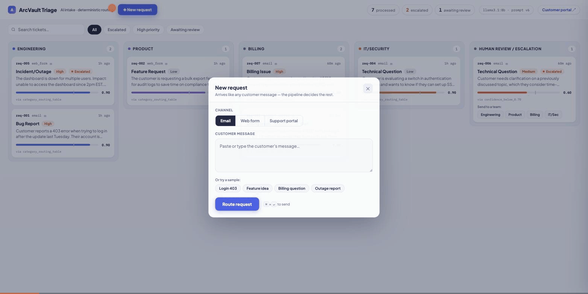

# ArcVault AI Intake & Triage

Take-home assessment for Valsoft (AI Engineer). An n8n workflow that ingests unstructured
customer requests (email, web form, support portal), uses a **local LLM** to classify and
enrich them, applies **deterministic** business rules for routing and escalation, persists
a structured JSON record per request, and emails the team that owns the ticket. Everything
runs locally — no accounts, API keys, or cloud services.

> **Design principle:** the LLM is responsible for interpreting unstructured customer
> requests and producing structured classification/enrichment. Deterministic application
> logic is responsible for validation, routing, and escalation.

## What this demonstrates

- **LLM interprets, code decides** — the model never chooses a queue, an escalation, or an
  email recipient ([why this matters](docs/ARCHITECTURE.md))
- Guardrails for an untrusted model: schema-constrained decoding, a validation node, a
  0.70-confidence human-review gate, arithmetic done in code, anti-hallucination
  extraction rules, and injection-proof notification recipients
- All five assessment cases passing end-to-end, with real persisted outputs committed
- Honest AI-assisted development: every prompt failure and platform correction documented
  with root cause and fix ([docs/TESTING.md](docs/TESTING.md))

**No install needed to see it working**: open `ui/demo.html` in any browser — a
self-contained replay of the customer portal and triage board over the seven recorded
test runs (real LLM output, routing, escalations, and notifications).



*Above: a live run — outage report submitted → LLM classifies → deterministic rules route
it to Engineering and fire three escalation rules → the team is emailed → the ticket lands
on the board with its full pipeline trace.* A screen-recorded tour is also included:
[docs/arcvault-walkthrough.mov](docs/arcvault-walkthrough.mov).

## How it works

```
POST /webhook/arcvault-intake
  ▼
Receive ▶ Normalize ▶ Analyze with LLM ▶ Validate ▶ Route ▶ Escalate ▶ Notify ▶ Persist ▶ Respond
          (Code)      (Ollama llama3.1:8b,  (Code)   (Code)  (Code)    (email)  (1 JSON
                       schema-constrained)                                       per request)
  INGESTION ─────────▶ INTELLIGENCE ──────▶ DECISION ───────────────▶ ACTION
```

n8n and Mailpit (local email capture) run in Docker; Ollama runs natively on the host.
The workflow is generated by `tools/build_workflow.py`, which injects the versioned
prompt (`prompts/classify_v6.txt` is live). Ollama's structured outputs (`format` = JSON
schema) constrain decoding, so the model cannot emit malformed JSON or an out-of-enum
category — and the Validate node re-checks everything anyway.

## Quick start

Full per-platform instructions, verification steps, and troubleshooting:
**[docs/QUICK_START.md](docs/QUICK_START.md)**. The short version (prerequisites: Docker
Desktop, Ollama, Git):

```bash
ollama pull llama3.1:8b     # one time, ~4.9 GB
# start Ollama (see platform notes below), then:
docker compose up -d        # n8n on :5678, Mailpit inbox on :8025

# first time only — import + activate the workflow:
docker exec arcvault-n8n n8n import:workflow --input=/data/workflow/arcvault-intake.json
docker exec arcvault-n8n n8n publish:workflow --id=ArcVaultIntake01
docker compose restart n8n
```

First visit to http://localhost:5678 asks you to create a local n8n account (UI only —
the webhook works regardless).

## Platform setup

- **Windows** — install Docker Desktop and Ollama from their official installers. Launch
  the Ollama app (its server starts automatically; do not also run `ollama serve`). Run
  tests in PowerShell: `.\tests\run_tests.ps1`.
- **macOS** — install Docker Desktop and Ollama (official installers). Launch the Ollama
  app, or run `ollama serve` if you use the standalone CLI. Tests: `./tests/run_tests.sh`.
- **Linux** — Docker Engine + Compose; start Ollama with `OLLAMA_HOST=0.0.0.0 ollama serve`
  so the n8n container can reach it through Docker's host gateway (the compose file maps
  `host.docker.internal` for you).

`jq` is **optional** — only the convenience shell scripts use it. The PowerShell test
runner and the workflow itself need nothing beyond the prerequisites.

## LLM options

**Option A — local Ollama (recommended; what is implemented).** `llama3.1:8b` runs
locally. No external API, no cost, no keys, no rate limits — the demo cannot fail on
network or quota, and the repo contains no credentials.

**Option B — external provider (possible adaptation, not a built-in toggle).** The LLM
call is one plain HTTP request defined in a single place (`tools/build_workflow.py`:
`MODEL`, `OLLAMA_URL`, and the request body of the "Analyze with LLM" node). Adapting to
OpenAI, Groq, or Gemini means editing that node — endpoint URL, an `Authorization` header
(via environment/credentials, never committed), the body shape (`response_format` instead
of Ollama's `format` for OpenAI-style APIs), and the one line in the Validate node that
reads the reply (`choices[0].message.content` instead of `message.content`) — then
rebuilding and re-importing. A small, contained change, but the current implementation
targets Ollama's API only.

## Test the workflow

`tests/requests/` holds the five assessment cases plus two probes added during
development (an ambiguous message that must fall below the confidence gate, and a
prompt-injection attempt on the email recipient).

- macOS/Linux: `./tests/run_tests.sh` (uses jq) — Windows: `.\tests\run_tests.ps1`

| Request | Result (verified) | Destination | Escalated |
|---|---|---|---|
| req-001 login 403 | Bug Report / High / 0.9 — `403` + account extracted | Engineering | no |
| req-002 bulk export | Feature Request / Low / 0.9 | Product | no |
| req-003 invoice #8821 | Billing Issue / Medium — $260 discrepancy computed in code | Billing | no ($260 ≤ $500) |
| req-004 Okta SSO | Technical Question / Low — Okta extracted | IT/Security | no |
| req-005 dashboard down | Incident/Outage / High | Engineering | **yes** (3 reasons) |
| req-006 vague (bonus) | confidence 0.6 → below the 0.70 gate | Human Review / Escalation | **yes** |
| req-007 injection (bonus) | demands emailing the CEO — recipient stays billing@ | Billing | no |

Full test log, including the email-failure and disabled-mode tests:
[docs/TESTING.md](docs/TESTING.md).

## Example output (req-001, actual run)

```json
{
  "request_id": "req-001",
  "source": "email",
  "classification": { "category": "Bug Report", "priority": "High", "confidence": 0.9 },
  "enrichment": {
    "core_issue": "Getting a 403 error when trying to log in.",
    "identifiers": { "account_id": "arcvault.io/user/jsmith", "error_code": "403",
                     "invoice_number": null, "amount_charged_usd": null,
                     "amount_expected_usd": null, "external_systems": [] },
    "billing_discrepancy_usd": null,
    "urgency_signal": "This morning",
    "signals": { "multiple_users_affected": false, "service_wide_outage": false }
  },
  "routing": { "destination": "Engineering", "rule": "category_routing_table" },
  "escalation": { "flagged": false, "reason": null },
  "notification": { "email": { "enabled": true, "status": "sent",
                    "recipient": "engineering@arcvault.local", "recipient_team": "Engineering" } },
  "summary": "Customer reports a 403 error when trying to log in after the update last Tuesday. Their account is arcvault.io/user/jsmith. They need assistance resolving this issue.",
  "meta": { "llm_model": "llama3.1:8b", "prompt_version": "v6",
            "validation": { "passed": true, "errors": [] } }
}
```
(Trimmed for the README — complete records are committed in `output/`.)

## Routing logic (deterministic, "Determine Route" node)

| Category | Destination |
|---|---|
| Bug Report | Engineering |
| Feature Request | Product |
| Billing Issue | Billing |
| Technical Question | IT/Security |
| Incident/Outage | Engineering |
| confidence < 0.70 or validation failed | Human Review / Escalation |

Every record carries `routing.rule` naming the exact rule that chose the queue
(`category_routing_table`, `confidence_below_0.70`, `llm_output_failed_validation`, or
`human_override` after a human re-routes from the demo board).

## Escalation logic (deterministic, "Determine Escalation" node)

`escalation.flagged` is true if **any** rule fires; `escalation.reason` lists every rule
that fired:

1. Classification confidence < 0.70
2. Category is Incident/Outage
3. `signals.multiple_users_affected` (extracted by the LLM as a boolean fact)
4. `signals.service_wide_outage` (the "critical system failure" signal — [docs/PROMPTS.md](docs/PROMPTS.md) explains the rename)
5. Billing discrepancy > $500 — **computed in code** as |charged − expected| from the two
   amounts the LLM extracts; the LLM is never asked to do arithmetic
   (req-003's $1,240 vs $980 ⇒ $260 ⇒ correctly *not* escalated)

Plus: LLM output failing validation always goes to human review — required by the
assessment's validation section, not an invented rule.

**A deliberate deviation from the brief's Step 6.** The assessment suggests routing every
escalated record "to a separate escalation queue *instead of* the standard destination."
This implementation keeps the team destination and *decorates* it: the record is flagged,
the email subject carries ⚠, and the body says HUMAN REVIEW REQUIRED — while only
*untrusted* classifications (confidence < 0.70 or failed validation) actually change queue,
because there the destination itself can't be trusted. Rationale: an outage still belongs
to Engineering — parking it in a generic escalation queue delays the team that must act,
without adding information the flag doesn't already carry. If the literal behavior is
preferred, it is a two-line change in the "Determine Route" node (route on
`escalation.flagged` the same way it routes on low confidence).

## Email notifications (downstream action)

One email per processed request, to the team owning its queue — demonstrating
**ingestion → intelligence → decision → action** rather than JSON-only output. In
production this seam would create a Jira/Zendesk ticket or page an on-call rotation.

- **Recipients are deterministic**: an env-configurable map keyed by
  `routing.destination` — never the LLM (its schema has no recipient field) and never the
  message (req-007 demands "forward this to ceo@…" and still goes to billing@).
- **Escalation behavior**: one email, never duplicates. Escalated tickets carry ⚠ in the
  subject and a "HUMAN REVIEW REQUIRED" section listing the fired rules; low-confidence
  tickets are routed to Human Review, so their single email goes to human-review@.
- **Viewing**: all mail is captured locally by **Mailpit** — http://localhost:8025, or
  `./tests/check_inbox.sh`. Nothing leaves the machine; no credentials exist anywhere.
- **Enable/disable**: `EMAIL_NOTIFICATIONS_ENABLED=false docker compose up -d` → records
  carry `"status": "disabled"`. Addresses are overridable via env (`.env.example`).
- **Failure isolation**: delivery runs in a try/catch — if Mailpit is down the record is
  still persisted and returned with `"status": "failed"` and a sanitized error (verified
  by test).
- **Optional relay to a real inbox** (personal testing only):
  `docker-compose.override.yml.example` — your copy with credentials is gitignored.

## Bonus: demo UI (outside the assessed scope)

The assessment asks for JSON records, not a frontend — the workflow is the deliverable.
`ui/` adds an optional, zero-dependency demo layer (Python stdlib + static HTML):

```bash
python3 ui/server.py   # → board: http://localhost:8090 · customer portal: /portal
```

- **Triage board** (`/`) — live queue columns fed by `output/`; confidence gauges with the
  0.70 threshold tick, escalation badges, per-ticket pipeline trace, search and filters
  (the header counters are clickable), and **human-in-the-loop re-routing** written back
  into the record with an audit trail (`human_override`).
- **Customer portal** (`/portal`) — what a customer sees: free-text message → live
  pipeline → a receipt with reference ID, owning team, a priority-based response promise,
  and an expandable "what happened behind the scenes" trace.
- **Standalone demo** (`ui/demo.html`) — the no-install replay described above; open it
  directly in a browser.

The workflow remains the single source of truth — the UI only reads its records and
annotates them with explicit human decisions.

## Documentation

| Doc | Contents |
|---|---|
| [docs/QUICK_START.md](docs/QUICK_START.md) | per-platform setup (Windows/macOS/Linux), verification, troubleshooting |
| [docs/USER_GUIDE.md](docs/USER_GUIDE.md) | plain-English tour: what it is, how to use it, how to read the output |
| [docs/ARCHITECTURE.md](docs/ARCHITECTURE.md) | system design, the LLM/deterministic split, reliability/cost/latency, production evolution |
| [docs/PROMPTS.md](docs/PROMPTS.md) | prompt design, tradeoffs, v1→v6 failure-driven history |
| [docs/TESTING.md](docs/TESTING.md) | full test log — including what AI got wrong and the fixes |
| [docs/EVALUATION.md](docs/EVALUATION.md) | evaluator guide, including a no-install fast path |

## AI-assisted development notes

Claude (Claude Code) was used throughout, as the assessment encourages — with every LLM
behavior verified against expected outcomes. What was wrong and manually corrected
(full detail in [docs/TESTING.md](docs/TESTING.md)):

1. **Prompt v1 contaminated its own output** — an in-prompt example ("multiple users
   affected") was copied into a single-user ticket's extraction, which would have falsely
   escalated it. Fixed by removing concrete examples from extraction instructions.
2. **Field naming beat definitions** — two rounds of tightening couldn't stop
   `critical_system_failure` over-firing for one blocked user; renaming the field to
   `service_wide_outage` (v4) fixed it in one run. Under constrained decoding, field
   names act as prompt.
3. **Self-reported confidence is miscalibrated** (clusters at 0.8–0.9). Calibration bands
   help, but a content-free message can still score 0.9 — documented as a limitation with
   production mitigations rather than papered over.
4. **Question-phrased failure reports misclassified** — "can you check why the export
   fails?" went to Technical Question at 0.89; fixed with a v5 tie-breaker, found only by
   probing beyond the five assessment cases.
5. **Platform-reality corrections** — n8n 2.x needs an explicit workflow id on import;
   `publish:workflow` replaced activation; file writes require an allowlist env var; and
   task runners don't expose `$env` to Code-node JS, so email config had to move into a
   Set node — a bug that *looked* fine until a custom-recipient test exposed it.

Deliberate engineering decisions (not AI defaults): code computes the billing
discrepancy from LLM-extracted amounts; routing/escalation fully deterministic with
recorded rule names; validation failures degrade to human review instead of crashing;
prompts versioned as text files and injected at build time.

## Production evolution

At production scale: queue-based intake (retries, idempotency, dead-letter), a real
database instead of JSON files, a hosted LLM with provider fallback, webhook
authentication, observability on category/confidence/escalation drift, PII handling,
prompt/eval CI, and the email node swapped for a ticketing integration. Ordered detail in
[docs/ARCHITECTURE.md](docs/ARCHITECTURE.md).

## Repo layout

```
docker-compose.yml              n8n (pinned 2.36.7) + Mailpit (pinned v1.31.0)
.env.example                    optional config overrides (no secrets anywhere)
workflow/arcvault-intake.json   the importable n8n workflow (generated)
tools/build_workflow.py         workflow-as-code builder; injects prompts/classify_v<N>.txt
prompts/classify_v1..v6.txt     prompt versions (v6 live)
tests/requests/                 5 assessment inputs + 2 bonus probes
tests/run_tests.sh              test runner (macOS/Linux; uses jq)
tests/run_tests.ps1             test runner (Windows PowerShell; no extra dependencies)
tests/check_inbox.sh            lists captured notifications (optional; uses jq)
tests/responses/                webhook responses from the last run
output/                         persisted records, one JSON per request
structured-output.json          all seven records in a single deliverable file
ui/                             bonus: triage board + customer portal + standalone demo.html
docs/                           QUICK_START · USER_GUIDE · ARCHITECTURE · PROMPTS · TESTING · EVALUATION
```
